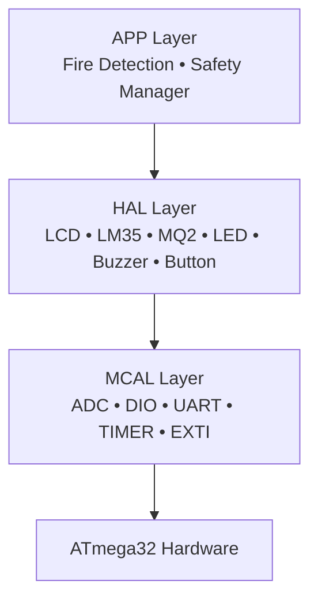

<div align="center">

# 🔥 Fire Detection System

An embedded fire & smoke detection system built on the **ATmega32**, using a **layered architecture**.


</div>

---

Welcome, Instructor, to our project.

## Team 7 — Resistors on Fire

**Team Leader:** Eng. Hesham Ahmed

**Team Members:**
1. Beshoy Esmat
2. Yousef Medhat
3. Ali Mohamed
4. Rohayem Moataz
5. Moaz Ahmed

---

## Table of Contents

- [Overview](#overview)
- [System Architecture](#system-architecture)
- [Tools Used](#tools-used)
- [Objectives](#objectives)
- [Project Structure](#project-structure)
- [Alarm Levels](#alarm-levels)
- [Course Information](#course-information)
- [License](#license)
- [Acknowledgment](#acknowledgment)

---

## Overview

The **Fire Detection System** is an embedded system built on the **ATmega32** microcontroller. It displays the room's temperature and detects smoke/fire, triggering alarms to warn people before a hazard escalates. The project follows a **layered architecture** to keep the code modular, maintainable, and easy to test.

---

## System Architecture

The system follows a classic three-layer embedded architecture, where each layer only talks to the one directly below it:



- **APP** — Application logic: fire-state classification and safety management
- **HAL** — Hardware Abstraction Layer: drivers for sensors and actuators
- **MCAL** — Microcontroller Abstraction Layer: direct register-level peripheral control

---

## Tools Used

| Tool | Purpose |
|------|---------|
| VS Code | IDE for writing the code |
| Git / GitHub | Version control and collaboration |
| Discord | Team communication |
| Trello | Task tracking (To Do / In Progress / Done) |
| Proteus | Hardware simulation of the full system |
| SimulIDE | Quick isolated component testing |
| Embedded Builder | Building the project and debugging |

---

## Objectives

1. Continuously monitor environmental conditions
2. Detect possible fire hazards
3. Classify warning severity
4. Trigger alarms automatically
5. Display system status
6. Allow user acknowledgment
7. Log important events
8. Support serial diagnostics
9. Implement reliable safety logic
10. Build a modular embedded software architecture

---

## Project Structure

```
Fire_Detection_System/
│
├── APP
│   ├── main.c
│   ├── Fire_Detection/
│   │   ├── Emergency
│   │   ├── Fire
│   │   ├── Normal
│   │   └── Warning
│   └── Safety_Manager/
│       ├── System
│       ├── Event_Logger
│       ├── Monitoring
│       └── Recovery
│
├── HAL
│   ├── LCD
│   ├── LM35
│   ├── MQ2
│   ├── LED
│   ├── Buzzer
│   └── Button
│
├── MCAL
│   ├── ADC
│   ├── DIO
│   ├── UART
│   ├── TIMER
│   └── EXTI
│
├── LIB
│   ├── STD_TYPES.h
│   └── BIT_MATH.h
│
└── README.md
```

---

## Alarm Levels

| Level | Description   |
|:-----:|---------------|
| 0     | 🟢 Normal        |
| 1     | 🟡 Warning       |
| 2     | 🟠 Fire Detected |
| 3     | 🔴 Emergency     |

---

## Course Information

**Embedded Systems Diploma**

**Topics Covered:**
- Embedded C
- AVR Architecture
- ADC
- LCD
- UART
- Timers
- Interrupts
- State Machines
- Safety Logic
- Driver Development

---

## License

This project was developed during the **NTI Embedded Systems Training Program**.

Licensed under the **MIT License**.

**Project Organization:** Gestell

---

## Acknowledgment

Special thanks to:

- National Telecommunication Institute (NTI)
- Eng. Hesham Ahmed
- Gestell Team

for their support and guidance throughout this project.
